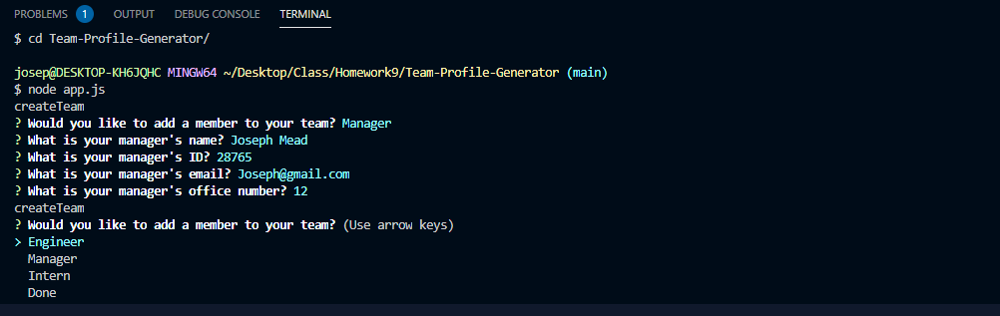
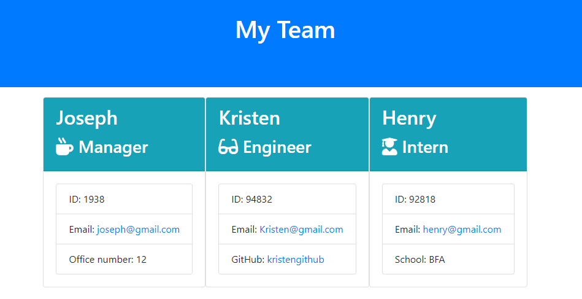
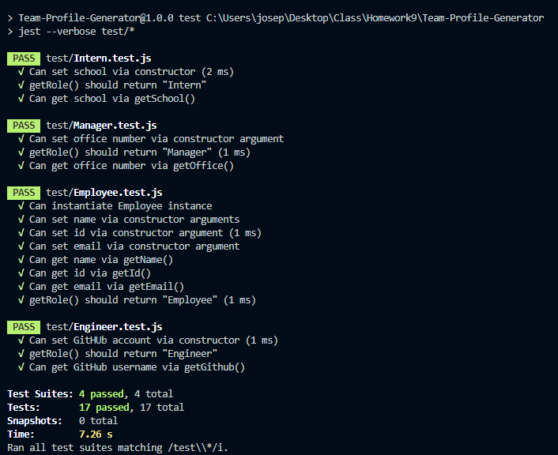

# Team-Profile-Generator
---

The project is a backend based card generator for creating team members into cards.

## Installation
---

To run this program rune node.js and preform a npm install to install all necessary node modules. Then you can run this program via the command "node app.js".

## Project Description
---

This generator is a node command line input application that requests information from a user to setup a team of engineers, interns, and a manager. For each instance there are common questions such as name, id, and email. Though each class has a unique questions that follows. For the intern the user is prompted to identify the school that the intern is attending, for the engineer the user is prompted for the gihub name of that engineer, and for the manager the office number is required. Once the team has been fully built out the user can choose the "done" option which in turn creates a html file within the output folder. This can then be viewed in any web browswer for a quick reference of all the critical information for your team.

Here is a screenshot of the manager portion of the command line input: 

---

And here is an example of the outputed html file:

## Tests
---

With this project there are tests for each of the indiviual classes Employee, Engineer, Intern, and Manager. As the screenshot below shows, all test run and pass. To run these tests you will need to run "npm i jest". After this your can use the command "npm test", this will run all of the tests associated with this project. 

